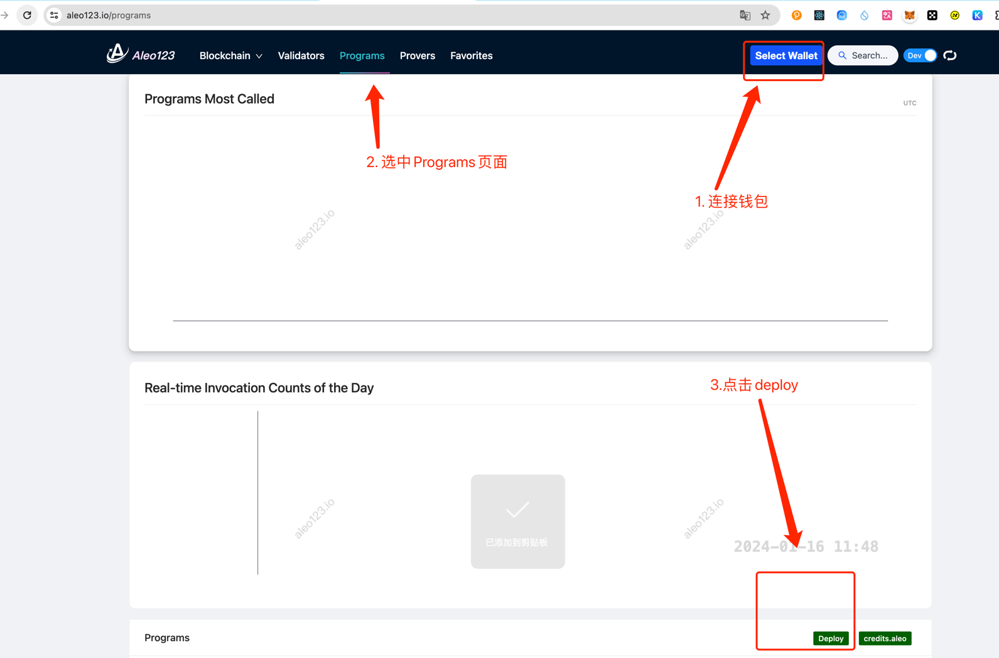
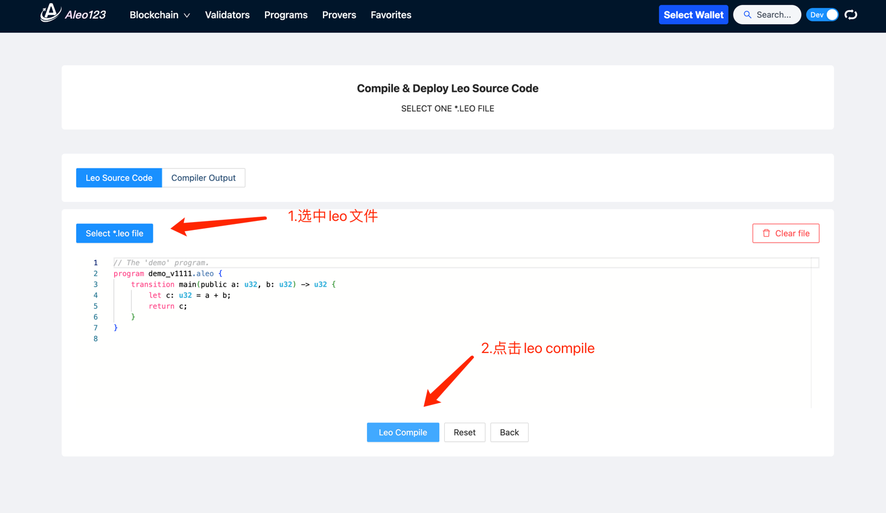
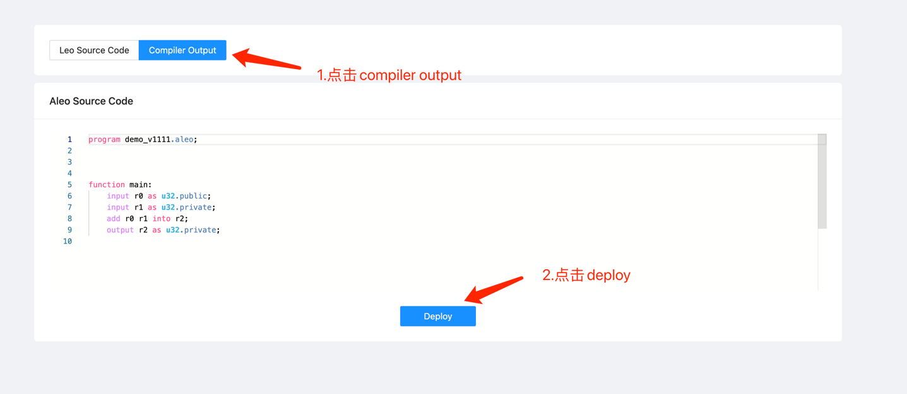

# aleo_zkworkshop
# 1.安装git
sudo apt-get install git-all
# 2.安装 rust
curl --proto '=https' --tlsv1.2 -sSf https://sh.rustup.rs | sh

# 3.从源码构建 leo
git clone https://github.com/AleoHQ/leo
cd leo
cargo install --path .

# 4. 安装snarkOS
git clone https://github.com/AleoHQ/snarkOS.git --depth 1
cd snarkOS
cargo install --path .

# 5. 安装soter钱包
https://sotertech.io/download/

# 6. 初始化leo合约
```leo new {$NAME}```

```package/
├── .env # 环境变量
├── program.json # 配置文件
├── README.md 
├── build/ #编译输出aleo的路径
├── inputs/
│ ├── hello.in # 程序输入
└── src/
  └── main.leo # 程序文件
```

# 7. 编译leo文件
```leo build```

```console output:
     Leo ✅ Compiled 'main.leo' into Aleo instructions
```
# 8. 部署到aleo网络
```
snarkos developer deploy --private-key {$PRIVATE_KEY} --priority-fee 100 --query {$NODE_URL} --broadcast {$NODE_URL}/testnet3/transaction/broadcast ./build
```

# 9. 执行合约
```
snarkos developer execute {$PACKAGE_NAME} {$FUNCTION_NAME} \'{$PARAMETER}\' --private-key {$PRIVATE_KEY} --priority-fee 100 --query {$NODE_URL} --broadcast {$NODE_URL}/testnet3/transaction/broadcast
```

# 10. 使用aleo123 部署合约




